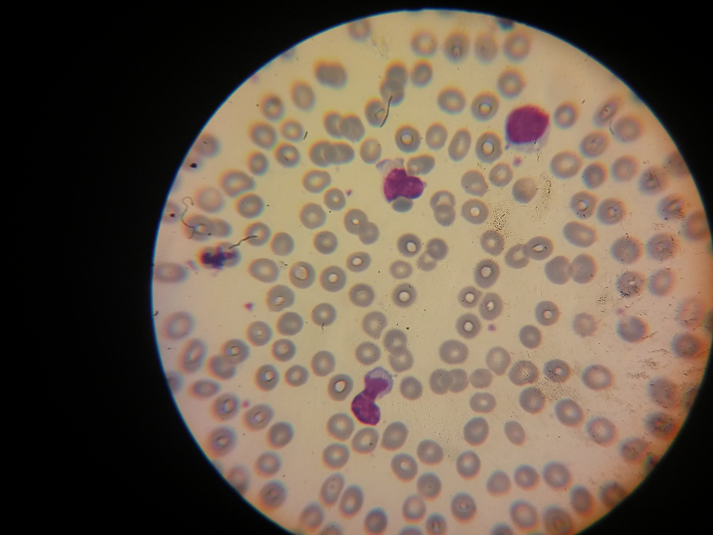
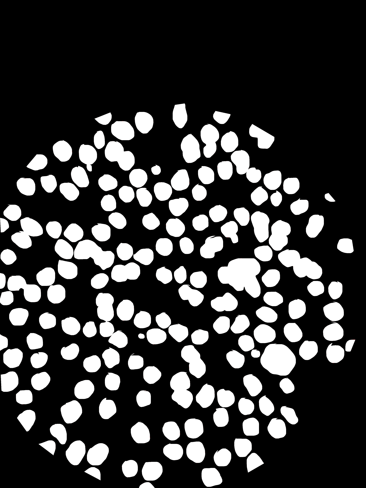

# ReVGG-R2Net Blood Cell Segmentation Dataset

This repository contains sample images and corresponding masks for microscopic blood cell segmentation used in the paper **ReVGG-R2Net: Optimized recurrent framework for microscopic blood cell segmentation**.

## Dataset Example

| Image | Mask |
|-------|------|
|  |  |

The first column shows the original microscopic blood cell image, and the second column shows its corresponding mask.

---

## Citation

If you use this dataset in your research or publications, please cite the following paper:

```bibtex
@article{akter2026revgg,
  title={ReVGG-R2Net: Optimized recurrent framework for microscopic blood cell segmentation},
  author={Mst Shapna Akter and Md. Fahim Sultan and Tasmin Karim and Md. Shazzad Hossain Shaon},
  journal={Tissue and Cell},
  year={2026}
}
